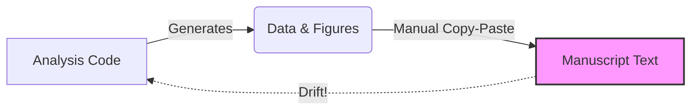

# Unit Testing Science: The Case for Reproducible Manuscripts

**"I almost published a paper with a 70% error in a key figure. My code was correct. My data was correct. But the figure file in the folder was three weeks old."**

This is the nightmare of every computational scientist. You change a parameter, re-run the analysis, and get a slightly different result. You update the abstract, but forget to update Table 2. You update the code, but forget to regenerate Figure 4.

The result is **Manuscript Drift**: the silent divergence between what your code *actually* computes and what your paper *says* it computes.



## The Problem: The Dangerous Gap

In modern science, we have rigorous tools for code (Git, CI/CD, Unit Tests) and rigorous tools for writing (LaTeX, Overleaf). But we have almost **no tools for the connection between them.**

Most scientists rely on manual synchronization:
1. Run script.
2. Look at terminal output (`efficiency = 0.824`).
3. Type `0.824` into LaTeX.
4. Repeat for 50+ numbers.

This process is fragile, manual, and unscalable. It relies entirely on human memory and discipline. In software engineering, we know that **hope is not a strategy.**

## The Solution: Reproducible Verification

We propose a new paradigm for scientific publishing: **Reproducible Manuscripts with Contract-Driven Verification.**

Instead of manually copying numbers, we define a **Single Source of Truth** (SSOT) that serves as a contract between the analysis and the text.

### 1. The Contract (`numerical_claims.yaml`)

We move all numerical assertions out of the text and into a machine-readable file. This file defines exactly what the paper claims.

```yaml
# numerical_claims.yaml
results:
  experiment_a:
    efficiency: 0.854   # The paper claims 85.4%
    p_value: 0.04       # The paper claims significant result
    
figures:
  required:
    - filename: "fig1_efficiency.png"
      generator: "plot_efficiency.py"
```

### 2. The Enforcer (Verification Script)

We run a lightweight script that compares your **Raw Data** (CSVs, Logs) against your **Contract**.

  * **Does the CSV say 0.82?** But the Contract says 0.85? → **FAIL.**
  * **Is `fig1.png` older than `plot_efficiency.py`?** → **FAIL.**
  * **Is the P-value within tolerance?** → **PASS.**

### 3. The Gatekeeper (Git Hook)

We install a `pre-commit` hook. If you try to commit changes while the manuscript is inconsistent, **git refuses the commit.**

```text
❌ [DAT_001] Experiment A Efficiency
    Details: Calculated 0.821, Expected 0.854
    Hint:    Update numerical_claims.yaml or fix analysis code.
⛔ FAILED: Commit blocked.
```

## The "Gallery of Failure"

This system is designed to catch the specific, subtle errors that lead to retractions and errata:

  * **The Stale Figure:** You tweaked the font size in the plotting script but didn't re-run it. The repo contains the old version.
  * **The "Zombie" Number:** You mention "5.9σ tension" in the Introduction, but your new analysis found "5.1σ". You updated the Results section but forgot the Intro.
  * **The Rounding Error:** Your code outputs `0.049`, but you typed `0.04` in the paper. The verifier catches this precision loss.

## Getting Started

We have open-sourced this framework as a GitHub Template. You don't need to change your entire workflow to use it.

1.  **Clone the Template:** Start your next paper with our structure.
2.  **Define your Claims:** Fill out the YAML file.
3.  **Sleep Soundly:** Know that your manuscript is mathematically consistent.

[**View the Repository & Template**](https://github.com/ylecoyote/reproducible-manuscript-template)
